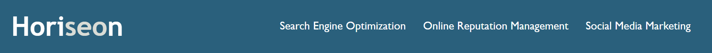
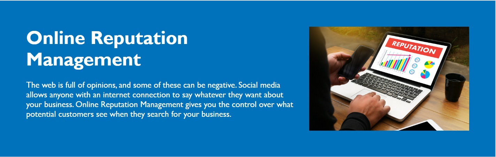
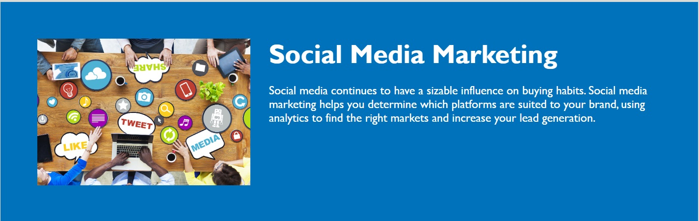

# 02-CHALLENGE

## Description

This challenge showed me how to manage and simplify the interaction between the HTML code (index.html) and the CSS code (styles.css). Also, I was able to better undertand each element of the code while taking notes to explain the lines and ensure how style and placement of the elements in the code are crucial to debugging them by a reverse engineering analysis.

The changes made were an important tool to deepen the analysis of each line whether they could be able to be aggregated to other sections of the code to summarize and keep it cleaner.

Based on user story to attend all the requirements of the acceptance criteria, such as, interaction and faster navigability, all image assets have been resized to have a faster page upload.

Therefore, each single information is an essential step for us to look at future improvements that will come with each new challenge.

## Usage
This webpage has been developed using VS Code, where the structure was created in HTML and CSS. 

The webpage refers to a marketing company, which aims to optimize and provide solid and profitable technological solutions over the internet.

The main image is intended to show a committed marketing team sharing ideas to create a powerful project to achieve great results.

On top of the above image, there is a "header" that presents the name of the company and the services provided by them.
Each of the services provided is navigatable to the content inserted on the main page.

By clicking and selecting one of this bottoms (Search Engine Optimization / Online Reputation Management / Social Media Marketing) you will addressed to the correspondent topic."

    
    
      

In addition, you can navigate and look at the benefits that can be reached by the services on the right side of the services.

## Credits

Boot camp team members, who developed the base to the restructured.

## License

Licensed under the MIT license.